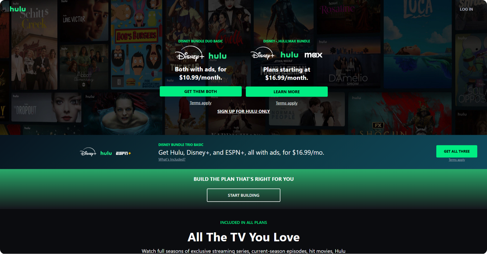

# 🎬 Hulu Website Clone

## 🌟 Project Overview
Welcome to the **Hulu Website Clone**! 🍿 This project is a stunning, fully responsive replica of the original **Hulu website**, designed to improve my frontend development skills and enhance my proficiency with **HTML**, **CSS**, and **Tailwind CSS**. The focus was on creating a sleek, modern UI that closely mimics the real Hulu experience while ensuring responsiveness on all devices.

## 🚀 Why Tailwind CSS?
Tailwind CSS is a game-changer for modern web development because it offers:
- 💪 Powerful utility-first classes for rapid styling.
- 🎨 Customization flexibility for unique designs.
- 📱 Responsive design capabilities right out of the box.
- ✨ Highly maintainable and readable code.

## 🌈 Visual Showcase


## 📝 Features
- ✅ Fully responsive design, adapting seamlessly to mobile, tablet, and desktop views.
- 🎥 Clean and intuitive UI similar to the original Hulu website.
- 🗂️ Organized and well-structured codebase with Tailwind CSS.
- 🚀 Smooth, modern design with attention to detail.
- 🔍 Eye-catching hero sections and trending movie cards.

## 🛠️ Getting Started
1. **Clone the repository**
   ```bash
   git clone https://github.com/Abuthahir-chalissery/Hulu-Clone-website.git
   ```
2. **Navigate to the project directory**
   ```bash
   cd Hulu-Clone-website
   ```
3. **Open `index.html` in your browser**
   ```bash
   Open index.html
   ```
4. **Experience the Look and Feel**
   - Test the responsiveness on multiple devices.
   - Explore the movie card layouts and hero sections.

## 🌱 Lessons Learned
- Mastered **responsive grid layouts** with Tailwind CSS.
- Gained confidence in **design consistency and spacing management**.
- Enhanced skills in **mobile-first design and responsiveness**.
- Learned to effectively **handle images and background sizes**.

## 🌐 Connect with Me
💬 Got feedback or ideas? Let me know!  
📧 Email: abuthahirchalissery162@gmail.com

---

=======

